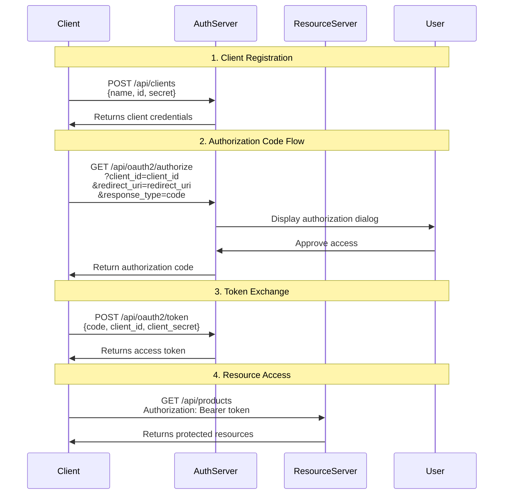

```mermaid
sequenceDiagram
    participant Client
    participant AuthServer
    participant ResourceServer
    participant User

    Note over Client,User: 1. Client Registration
    Client->>AuthServer: POST /api/clients<br/>{name, id, secret}
    AuthServer->>Client: Returns client credentials

    Note over Client,User: 2. Authorization Code Flow
    Client->>AuthServer: GET /api/oauth2/authorize<br/>?client_id=client_id<br/>&redirect_uri=redirect_uri<br/>&response_type=code
    AuthServer->>User: Display authorization dialog
    User->>AuthServer: Approve access
    AuthServer->>Client: Return authorization code

    Note over Client,User: 3. Token Exchange
    Client->>AuthServer: POST /api/oauth2/token<br/>{code, client_id, client_secret}
    AuthServer->>Client: Returns access token

    Note over Client,User: 4. Resource Access
    Client->>ResourceServer: GET /api/products<br/>Authorization: Bearer token
    ResourceServer->>Client: Returns protected resources
```
